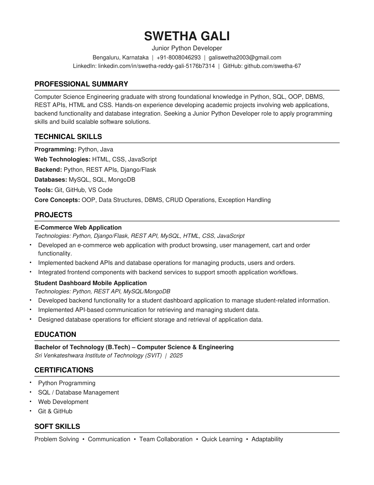

# Resume — Swetha Gali

ATS-friendly resume for **Swetha Gali** — Junior Python Developer.

## 📄 Download / View

- **[Download the PDF »](Swetha_Gali_Resume.pdf?raw=true)** ← click *Download* to open the resume
- Preview image below (GitHub's inline PDF viewer is unreliable, so a PNG preview is included)

## Preview



## Files

| File | Description |
|------|-------------|
| `Swetha_Gali_Resume.pdf` | The resume (single-column, ATS-friendly, selectable text) |
| `resume_preview.png` | Image preview of the resume (renders inline on GitHub) |
| `build_resume.py` | Python/ReportLab script that generates the PDF |

## Regenerate the PDF

```bash
pip install reportlab
python build_resume.py
```

## Contact

- **Location:** Bengaluru, Karnataka
- **Email:** galiswetha2003@gmail.com
- **LinkedIn:** [linkedin.com/in/swetha-reddy-gali-5176b7314](https://linkedin.com/in/swetha-reddy-gali-5176b7314)
- **GitHub:** [github.com/swetha-67](https://github.com/swetha-67)
