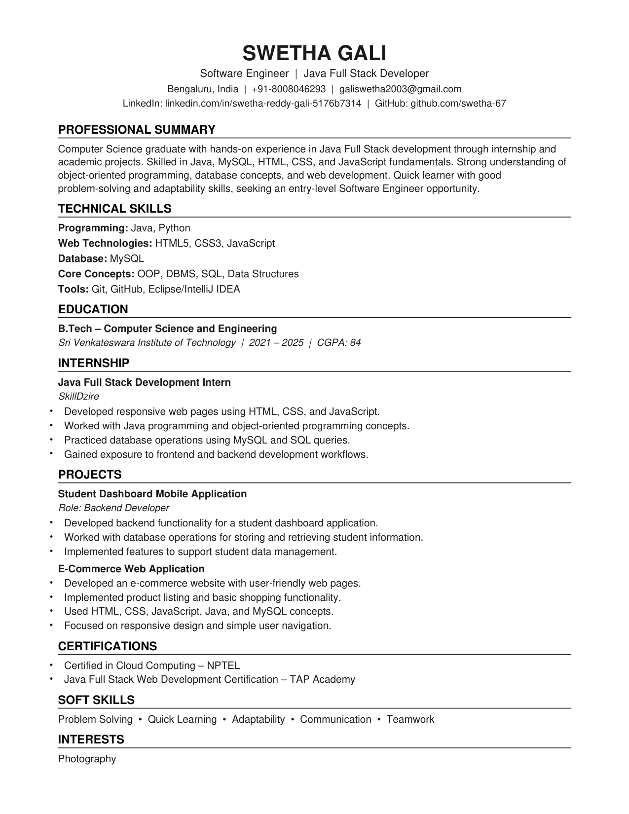

# Resumes — Swetha Gali

ATS-friendly resumes for **Swetha Gali**, available in two role-focused versions.

> **Note:** GitHub's inline PDF preview is unreliable and may show *"Invalid PDF"* — the PDFs are valid and open in any viewer. Use the **Download** links below, or view the PNG previews.

---

## 1. Junior Python Developer

- **[Download PDF »](Swetha_Gali_Resume.pdf?raw=true)** &nbsp;•&nbsp; **[Download Word (.docx) »](Swetha_Gali_Resume.docx?raw=true)**


---

## 2. Software Engineer — Java Full Stack Developer

- **[Download PDF »](Swetha_Gali_Resume_SoftwareEngineer.pdf?raw=true)** &nbsp;•&nbsp; **[Download Word (.docx) »](Swetha_Gali_Resume_SoftwareEngineer.docx?raw=true)**



---

## Files

| File | Description |
|------|-------------|
| `Swetha_Gali_Resume.pdf` / `.docx` | Junior Python Developer resume (PDF + editable Word) |
| `Swetha_Gali_Resume_SoftwareEngineer.pdf` / `.docx` | Software Engineer / Java Full Stack resume (PDF + editable Word) |
| `resume_preview.png` | Preview image (Python Developer) |
| `resume_se_preview.png` | Preview image (Software Engineer) |
| `build_resume.py` / `build_resume_se.py` | Generators for the PDF resumes |
| `build_docx.js` | Generator for the Word (.docx) resumes |

## Regenerate the PDFs

```bash
pip install reportlab
python build_resume.py
python build_resume_se.py
```

## Contact

- **Location:** Bengaluru, India
- **Email:** galiswetha2003@gmail.com
- **LinkedIn:** [linkedin.com/in/swetha-reddy-gali-5176b7314](https://linkedin.com/in/swetha-reddy-gali-5176b7314)
- **GitHub:** [github.com/swetha-67](https://github.com/swetha-67)
